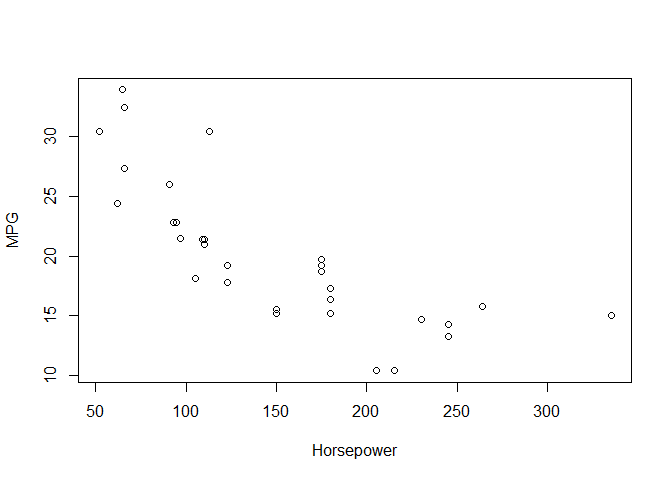
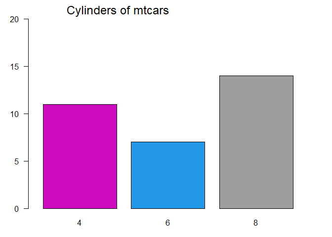
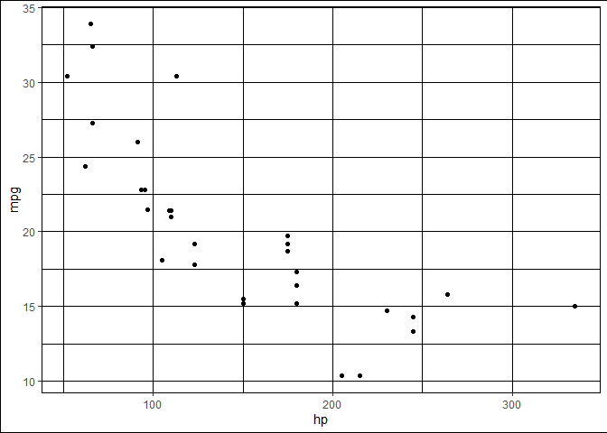
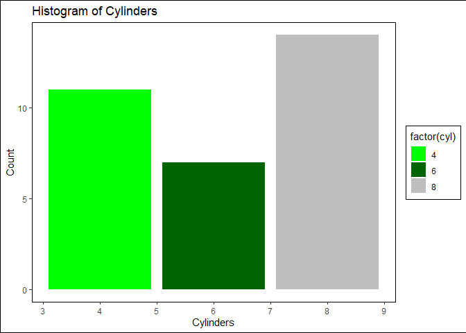
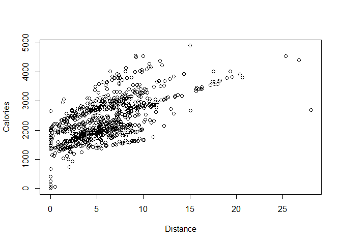
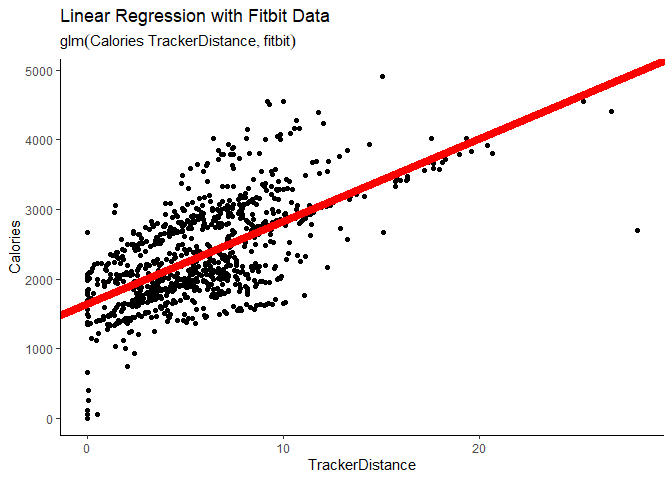
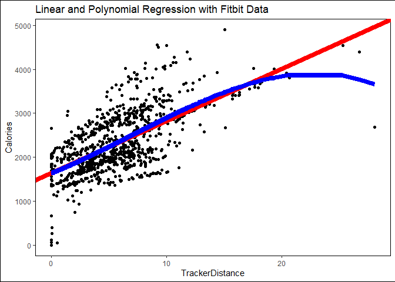

R, the tidyverse, and Machine Learning
================
Keaton Markey
2022/12/28

<link href="assets/css/style.css" rel="stylesheet">

This tutorial was prepared for a light overview of R, some of its
capabilities, and what machine learning looks like using the {glm} and
{caret} packages. It is assumed that you have some knowledge of
programming concepts, maybe some statistics,, but not necessarily any
experience with R or ML.

# Introduction

R is an integrated suite of software facilities built by statisticians
used for

- data manipulation

- calculation

- graphics

- data handling and storage

- operations on arrays, matrices

At its beginning, R was designed for stats, but now its a fully-fledged
programming language. Some other features of R:

- a large integrated collection of intermediate tools for data analysis

- a well-developed, simple and effective programming language (called
  `S`) which includes:

- conditionals

- loops

- user defined recursive functions

- input and output facilities

R comes with a lot of bells and whistles built in, but one of the things
I like most about it is the wealth of add-ons that are out there. Some
extensions of R that people commonly use:

- RStudio (a development environment)

- RMarkdown (markdown for R)

- Popular packages (dplyr, ggplot)

- and more packages (github, BioConductor)

- whole package ecosystems (tidyverse)

- applications (shiny)

- presentations

- and more!

For data science, R and python are the most widely used languages. There
are many similarities between the two. Developers can even combine the
strengths of both languages to do better data science.

# R Basics

In most people’s opinion, there are really two kinds of R:

- The more basic that comes installed with R (base R)

- and the tidyverse.

In most cases, base R works just fine, but the tidyverse supplies a
bunch of other functions (sometimes called `verbs`) that are designed to
make it easier to write and edit code.

To grasp some of the basic principles in R, we’ll fist use base R, and
then demonstrate some of the capabilities of the tidyverse.

## Creating Objects

(Using Base R)

First we’ll create a 1-dimensional object. An object is pretty much
anything that is stored in R. Objects can have many characteristics.
Objects can be very large, such as a big excel file, or very small, such
as a single number \# Here is a simple type of object, a vector (similar
to an array if you’re familiar with those). This code tells R to store
the vector with 3 numbers in an object called “vector1”.

``` r
vector1 <- c(1, 2, 3)
```

Now this vector is stored in R. We can “call” the object by just typing
out the name.

``` r
vector1
```

    ## [1] 1 2 3

This is different than printing out the object. Although it might look
the same, printing is only used for the purpose of seeing stuff.
“Calling” an object means that you want to interact with it.

One of the characteristics of any object in R is it’s class. We can get
the class by applying the function `class()`. Functions are really
important in programming. The define a set of operations that are
performed on whatever is inside the function. Here, R is telling us that
it recognizes the elements of “vector1” as numeric.

``` r
print(vector1)
```

    ## [1] 1 2 3

``` r
class(vector1)
```

    ## [1] "numeric"

## Indexing

Now that we have this object “vector1”, we can view different parts of
it. A vector is what is known as a on-dimensional object. If you think
about a vector like an spreadsheet, a vector would only be stored across
one axis, either in a row or a column, hence the term one-dimensional.
To view a certain part of (most) one-dimensional objects, we do what’s
called indexing. Indexing identifies each element as having a order in
the vector that doesn’t change unless we want it to

To get the first element of this vector, we can call the object, and
then index the first element like so:

``` r
vector1[1]
```

    ## [1] 1

What if we want the last two elements?

``` r
vector1[2,3]
```

    ## Error in vector1[2, 3]: incorrect number of dimensions

The comma inside the brackets tells R to start looking in another
dimension. Since this is a one-dimensional object, this fails. To get
the last two elements, we have to pass their indexes as another vector!

``` r
vector1[c(2,3)]
```

    ## [1] 2 3

## Lists

Another type of object is called a list. These are preferred when you
want to name each element. While vectors must have elements of all the
same class, lists can hold anything, even other objects! You should
always use names if possible, but you don’t even have to name every
element.

``` r
list1 <- c(crowd = "a", b = 12, vector1)
```

When we created the list, R automatically separated “vector1” into each
element.

``` r
list1
```

    ## crowd     b                   
    ##   "a"  "12"   "1"   "2"   "3"

Lets grab the second element and add a number.

``` r
list1[2] + 12
```

    ## Error in list1[2] + 12: non-numeric argument to binary operator

Before we do an operation, we need to make sure R recognizes everything
as a number. To do that, we need to apply a function to our object to
make it of numeric class.

``` r
as.numeric(list1[2]) + 12
```

    ## [1] 24

That’s better. There are lots of conversion functions:

- `as.character()`

- `as.numeric()`

- `as.factor()`

- and a few others

## Factors

Factors are a type of object that takes elements and stores them in
levels: unique values from all the elements. That means that if a value
shows up multiple times in a vector, it is stored as an index to another
vector that stores all the unique values.

``` r
factor1 <- factor(c(1, 4, 3, 6, 6, 0, 3, 9, 1))

# When we call a factor, we can see all its data and its levels

factor1
```

    ## [1] 1 4 3 6 6 0 3 9 1
    ## Levels: 0 1 3 4 6 9

``` r
class(factor1)
```

    ## [1] "factor"

## Matrices

Now let’s look at two-dimensional objects. The types that are most
essential are matrices and data frames. A matrix is a simple table of
stuff. Here we use the function `rnorm()` to generate data for our
matrix.

``` r
# ncol specifies how to separate the vectors

matrix1 <- matrix(data = c(rnorm(5, 4), rnorm(5, 7)), ncol = 2) 

matrix1
```

    ##          [,1]     [,2]
    ## [1,] 2.879958 7.224661
    ## [2,] 4.986080 7.185012
    ## [3,] 4.791872 5.119443
    ## [4,] 4.292041 6.184423
    ## [5,] 5.596733 7.030802

To index this class of object, the column names and row names give us a
pretty good idea. To get a specific element, index the row then column.

``` r
matrix1[3,1]
```

    ## [1] 4.791872

Matrices can also be indexed as one-dimensional by supplying one index.
The columns wrap to the next one.

``` r
matrix1[6]
```

    ## [1] 7.224661

``` r
matrix1[1,2]
```

    ## [1] 7.224661

To get a full row or column, just leave the other dimension blank.

``` r
matrix1[1,]
```

    ## [1] 2.879958 7.224661

## Data Frames

These are the bread and butter of data analytics. They are very similar
to a matrix or data table, except they have extra rules. Here we create
a data frame (df for short) with two named columns (like a list!)

``` r
dataframe1 <- data.frame(col1 = c(matrix1, 78, 44), col2 = 1:12)

class(dataframe1)
```

    ## [1] "data.frame"

``` r
dataframe1
```

    ##         col1 col2
    ## 1   2.879958    1
    ## 2   4.986080    2
    ## 3   4.791872    3
    ## 4   4.292041    4
    ## 5   5.596733    5
    ## 6   7.224661    6
    ## 7   7.185012    7
    ## 8   5.119443    8
    ## 9   6.184423    9
    ## 10  7.030802   10
    ## 11 78.000000   11
    ## 12 44.000000   12

Indexing these named columns is super easy with the “\$” operator. This
returns a vector.

``` r
dataframe1$col1
```

    ##  [1]  2.879958  4.986080  4.791872  4.292041  5.596733  7.224661  7.185012
    ##  [8]  5.119443  6.184423  7.030802 78.000000 44.000000

You can also index like you do with matrices, but since it’s a
dataframe, the first method is preferred.

``` r
dataframe1[,1]
```

    ##  [1]  2.879958  4.986080  4.791872  4.292041  5.596733  7.224661  7.185012
    ##  [8]  5.119443  6.184423  7.030802 78.000000 44.000000

## Conditional Indexing

Now is a good time to talk about indexing an object by using a
conditional representation of that object. That is, take a subset of the
data based on the data itself. First we need to express a conditional
using the “==” operator. This will tell us if objects in a vector are
equal to the other side. For example, we can get R to tell us if each
element is greater than 4.

``` r
greater_than_1 <- dataframe1$col1 > 4

greater_than_1
```

    ##  [1] FALSE  TRUE  TRUE  TRUE  TRUE  TRUE  TRUE  TRUE  TRUE  TRUE  TRUE  TRUE

Here, we receive a vector of boolean (True or False) values. We can use
this vector to index the original vector. So we only receive elements
from col1 where greater_than_1 is equal to True.

``` r
dataframe1$col1
```

    ##  [1]  2.879958  4.986080  4.791872  4.292041  5.596733  7.224661  7.185012
    ##  [8]  5.119443  6.184423  7.030802 78.000000 44.000000

``` r
dataframe1$col1[greater_than_1]
```

    ##  [1]  4.986080  4.791872  4.292041  5.596733  7.224661  7.185012  5.119443
    ##  [8]  6.184423  7.030802 78.000000 44.000000

This is an extremely powerful tool in base R. You can also create other
conditionals with:

- “\>=”

- “\<=”

- or “!=”

# Base R vs. tidyverse

Now lets get to the cool stuff. We are gonna pick up the pace a little
bit.

You can manipulate and clean data frames in R very easily, and the
tidyverse makes this quite intuitive. Base R handles elementary
operations very well, but its in the higher order operations like data
cleaning, manipulation, modeling, and graphics that the tidyverse
shines.

Though a built-in package, we can import standard datasets as an object
in our R session with ease. We don’t have to assign the data as an
object, R will do this for us.

``` r
data("mtcars")

class(mtcars)
```

    ## [1] "data.frame"

Lets get some information about this data we just pulled using the
`head()` function, which will show us the first few rows.

``` r
head(mtcars)
```

    ##                    mpg cyl disp  hp drat    wt  qsec vs am gear carb
    ## Mazda RX4         21.0   6  160 110 3.90 2.620 16.46  0  1    4    4
    ## Mazda RX4 Wag     21.0   6  160 110 3.90 2.875 17.02  0  1    4    4
    ## Datsun 710        22.8   4  108  93 3.85 2.320 18.61  1  1    4    1
    ## Hornet 4 Drive    21.4   6  258 110 3.08 3.215 19.44  1  0    3    1
    ## Hornet Sportabout 18.7   8  360 175 3.15 3.440 17.02  0  0    3    2
    ## Valiant           18.1   6  225 105 2.76 3.460 20.22  1  0    3    1

Here we see what we are working with. Take note of some of the column
names, what kinds of values each column seems to take, and the row names
as well.

Since mtcars is a dataframe, we can look at the “mpg” column using the
“\$” operator. We want to know the mean mpg of all the cars in this data
using the `mean()` function

``` r
mean(mtcars$mpg)
```

    ## [1] 20.09062

## Data Manipulation

Just like that. Now we’ll do a slightly more complex series of
calculations using base R and the tidyverse

### Base R

We can get the mean of the whole dataset, but often its more useful if
we can take parts of the dataset and compare them. The mean mpg of
certain categories can start to give information on how the category
might affect the mpg.

Lets look at the mean mpg of cars with 4 cylinders vs 6 cylinders. We’ll
do this two ways in base R.

First, the slower way. Index each group by the number of cylinders and.
In English, this reads:

> “Take the mean mpg where the number of cylinders is equal to 4”

``` r
mean(mtcars$mpg[mtcars$cyl == 4])
```

    ## [1] 26.66364

And for 6 cylinders

``` r
mean(mtcars$mpg[mtcars$cyl == 6])
```

    ## [1] 19.74286

Second, we can use a fancy function called `tapply()` which can apply a
function to a column based on the groups in another vector.

``` r
tapply(mtcars$mpg, mtcars$cyl, mean)
```

    ##        4        6        8 
    ## 26.66364 19.74286 15.10000

What if we do another calculation using just two of the columns, `disp`
and `wt`?

Lets get the average displacement to weight ratio of all the cars.

``` r
# Make a new object with all rows of the two columns named "disp" and "wt"

mycols <- mtcars[, c("disp", "wt")]

# Divide displacement by weight for each car and take the mean

mean(mycols$disp / mycols$wt)
```

    ## [1] 67.77537

### tidyverse

We can get the mean of the whole dataset, but often its more useful if
we can take parts of the dataset and compare them. The mean mpg of
certain categories can start to give information on how the category
might affect the mpg.

First, we need to introduce `%>%`, called the ‘pipe’ operator in the
tidyverse. This is used to connect two pieces of code together, where
the output of the code on the left is used as the input of the code on
the right. This was created to prevent people from using nested
functions.

For example:

``` r
library(tidyverse)
```

    ## -- Attaching packages --------------------------------------- tidyverse 1.3.2 --
    ## v tibble  3.1.8      v dplyr   1.0.10
    ## v tidyr   1.2.1      v stringr 1.5.0 
    ## v readr   2.1.3      v forcats 0.5.2 
    ## v purrr   0.3.5      
    ## -- Conflicts ------------------------------------------ tidyverse_conflicts() --
    ## x dplyr::filter() masks stats::filter()
    ## x dplyr::lag()    masks stats::lag()

``` r
class(mtcars)
```

    ## [1] "data.frame"

is the same as

``` r
mtcars %>%
    
    class()
```

    ## [1] "data.frame"

One more thing to know about the tidyverse is that it utilizes lazy
evaluation and data masking. This sounds fancy, but all it really means
is that once we pass data to a tidyverse function, we don’t have to call
the data anymore, just the column that we are interested in. No more
`data$column`! That’s good for us because that’s less typing and faster
analysis.

Okay, lets look at the mean mpg of cars with 4 cylinders vs 6 cylinders.
To use the tidyverse, we can make use of its built-in functions that can
tackle this exact problem.

``` r
mtcars %>%

# Here we take the data "mtcars" and use the "group_by()" function to group the data by the cyl value
# The group is 'hidden' within the function, but have faith its there
    
    group_by(cyl) %>%
  
# Now we tell R to use the grouped df to take the mean of "mpg" based on each "cyl" group, 
# independently of one another
# Lastly we just create a new column for the mean.
# We can easily create new columns inside "summarise()"  and "mutate()" with the "=" operator
    
    summarise(mean_mpg = mean(mpg))
```

    ## # A tibble: 3 x 2
    ##     cyl mean_mpg
    ##   <dbl>    <dbl>
    ## 1     4     26.7
    ## 2     6     19.7
    ## 3     8     15.1

Without the pipe operator, that code would look like this:

``` r
summarise(group_by(mtcars, cyl), mean_mpg = mean(mpg))
```

    ## # A tibble: 3 x 2
    ##     cyl mean_mpg
    ##   <dbl>    <dbl>
    ## 1     4     26.7
    ## 2     6     19.7
    ## 3     8     15.1

Not terrible, but with longs chains it can get messy fast, and we
couldn’t easily add comments between code.

What if we do another calculation using just two of the columns, `disp`
and `wt`?

Lets get the average displacement to weight ratio of all the cars.

``` r
# We can do this really fast!

mtcars %>%
    
    summarise(avg_ratio = mean(disp/wt))
```

    ##   avg_ratio
    ## 1  67.77537

The tidyverse is home to other methods as well:

- The pipe operator and others from {magrittr} %\>%

- Plotting methods from {ggplot2}

- and other improved read/write, string, and object type abilities

## Visualization

Plotting data is really important for analysis. Both base R and the
tidyverse have pretty robust graphics capabilities. Here are the basics.

### Base R

The most basic type of plot is the scatter plot. This takes values from
one column and values from another to put the points on a
two-dimensional coordinate plane. Right out of the box, base R plots
look fine.

Simple plots are pretty easy in base R. Call the `plot()` function and
put in two same-sized vectors. Here we can make sure that the `plot()`
function puts each object where we want by specifying them with a
keyword. These keyword symbolize function arguments. Most functions take
arguments, and its usually good to specify them with a keyword. In this
case, we are telling R to use horsepower on the x axis and mpg on the y
axis. We can supply our own labels too.

``` r
plot(x = mtcars$hp, mtcars$mpg, xlab = "Horsepower", ylab = "MPG")
```

<!-- -->

We can make a histogram too. `hist()` only takes one data argument and
automatically counts each group. Although its the more basic of the two
methods, plotting in Base R can look quite nice.

``` r
# "par()" is a function that adds some extra pizzazz to plots

par(mar = c(3, 3, 2, 1), # margins
    
    las = 1, # Y axis text rotated
    
    xaxs = "i", yaxs = "i") # Remove plot padding

barplot(tapply(mtcars$mpg, mtcars$cyl, length),
        
        col = unique(mtcars$cyl), # Fill color
        
        xlab = "Cylinders", ylab = "Count", # x and y labels
        
        xlim = c(0, 4), ylim = c(0, 20)) # Limits

title("Cylinders of mtcars", 
      
      adj = 0.2, # adjust location of the x axis
      
      cex.main = 1.5, font.main = 1, # font size and type
      
      col.main = "black")
```

<!-- -->

### tidyverse

The package responsible for handling most graphics in the tidyverse is
called ggplot2. ggplot2 uses a layering system to build a graph, where
each layer supplies information that is just laid on top of the
information that came previously. There are a few quirks to this package
in terms of where and how you supply data and the language, but its easy
to adjust to.

``` r
# ggplot is in the tidyverse so it uses data masking and lazy evaluation
# We can supply the data when we initialize a plot, with "ggplot()"

ggplot(mtcars) + 
    
    # Then we create a geometry layer of points
    # And supply aesthetics inside "aes()" where we can specify which columns are on the x axis and the y axis
    
    geom_point(aes(x = hp, y = mpg))
```

<!-- -->

We can make a barplot too.

``` r
ggplot(mtcars) + geom_bar(aes(x = cyl, fill = factor(cyl)), stat = 'count') +
    
    # Change the colors of the bars
    
    scale_fill_manual(values = c("green", "darkgreen", "grey")) +
    
    # We can rename the axes here with the "labs()" function
    
    labs(x = "Cylinders",
         y = "Count",
         title = "Histogram of Cylinders") +
    
    # Since the default ggplot theme is bare-bones, I usually throw on a better one
    # I'm using a custom theme similar to theme_classic(), but modified for this website
    
    my_theme()
```

<!-- -->

Data visualization is really important for the analyst to figure out
what’s going on and to ensure that the information is accurately
communicated to others. There are lots of industry-leading tools besides
R that use can use to visualize data. More info about one of these tools
can be found on [the Tableau
website](https://www.tableau.com/learn/articles/data-visualization).

Also, to learn how I created this custom theme, check out [this tutorial
by Maddie Pickens on
RPubs](https://rpubs.com/mclaire19/ggplot2-custom-themes).

# Machine Learning

There are two main classes of ML:


- Classification
  - Predicts discrete classes

  - The model can find parameters that minimize the prediction of
    incorrect category labels (Decision Boundary)
- Regression
  - Line of best fit

  - Predicts a continuous variable

  - It’s the model’s job to find parameters that minimize the distance
    between the line and the observed data

In its simplest form, and the form you will see in this tutorial, are 2
steps to Machine Learning

First, we get a framework to create a model. Broadly, a model is an
object that contains a relationship between a sequence of inputs and
outputs. The relationship can be extremely simple, such as in a linear
model with two parameters, where the output has a direct linear
relationship to the input, or extremely complex such as in a neural
network with many parameters, where the output has an indirect
non-linear relationship to the input. Typically, creating or “training”
a model means establishing a relationship that best describes the
output. Using an existing framework, you tell the program to create a
relationship. Typically the relationship is restructured many times
based on how well the output is described. Once it does a good-enough
job, it stops.

Once the model is trained and a relationship is established, then we can
give it new input and receive an expected output. There are many
considerations, evaluations, and tests that should be made along the
way, but the model should be generalization enough to produce insight
into data not available for standard data analysis.

Using real data, lets see what ML looks like in R. I’ll be using a
combination of the tidyverse and base R for this, and I won’t delve too
deep into the exact methods I’m using.

We’ll go through some of the steps of creating a model:

- Cleaning up the data
- Visualizing relationships
- Training models
- Model evaluation

We will use [Fitbit
Data](https://www.kaggle.com/datasets/gloriarc/fitbit-fitness-tracker-data-capstone-project),
courtesy of Gloria on Kaggle.

## Case 1: Linear Regression

For this exercise, we want to look at the relationship between the
number of calories burned `Calories` and the distance that people
traveled according to the device `TrackerDistance`.

``` r
# Read in the csv with "read_csv()" from the tidyverse
# Specify the path

fitbit <- read_csv("data/Daily_Activity_2022_27_02.csv")
```

    ## New names:
    ## Rows: 940 Columns: 18
    ## -- Column specification
    ## -------------------------------------------------------- Delimiter: "," chr
    ## (3): ActivityDate, ActivityDay, ...18 dbl (14): Id, TotalSteps, TotalDistance,
    ## TrackerDistance, LoggedActivitiesDi... lgl (1): ...17
    ## i Use `spec()` to retrieve the full column specification for this data. i
    ## Specify the column types or set `show_col_types = FALSE` to quiet this message.
    ## * `` -> `...17`
    ## * `` -> `...18`

``` r
# We can see all the classes of each column, very helpful!
```

Exploring the data is pretty much always the first step.

``` r
# view the data with "glimpse()" from tidyverse

glimpse(fitbit)
```

    ## Rows: 940
    ## Columns: 18
    ## $ Id                       <dbl> 1503960366, 1503960366, 1503960366, 150396036~
    ## $ ActivityDate             <chr> "4/12/2016", "4/13/2016", "4/14/2016", "4/15/~
    ## $ ActivityDay              <chr> "Tue", "Wed", "Thu", "Fri", "Sat", "Sun", "Mo~
    ## $ TotalSteps               <dbl> 13162, 10735, 10460, 9762, 12669, 9705, 13019~
    ## $ TotalDistance            <dbl> 8.50, 6.97, 6.74, 6.28, 8.16, 6.48, 8.59, 9.8~
    ## $ TrackerDistance          <dbl> 8.50, 6.97, 6.74, 6.28, 8.16, 6.48, 8.59, 9.8~
    ## $ LoggedActivitiesDistance <dbl> 0, 0, 0, 0, 0, 0, 0, 0, 0, 0, 0, 0, 0, 0, 0, ~
    ## $ VeryActiveDistance       <dbl> 1.88, 1.57, 2.44, 2.14, 2.71, 3.19, 3.25, 3.5~
    ## $ ModeratelyActiveDistance <dbl> 0.55, 0.69, 0.40, 1.26, 0.41, 0.78, 0.64, 1.3~
    ## $ LightActiveDistance      <dbl> 6.06, 4.71, 3.91, 2.83, 5.04, 2.51, 4.71, 5.0~
    ## $ SedentaryActiveDistance  <dbl> 0, 0, 0, 0, 0, 0, 0, 0, 0, 0, 0, 0, 0, 0, 0, ~
    ## $ VeryActiveMinutes        <dbl> 25, 21, 30, 29, 36, 38, 42, 50, 28, 19, 66, 4~
    ## $ FairlyActiveMinutes      <dbl> 13, 19, 11, 34, 10, 20, 16, 31, 12, 8, 27, 21~
    ## $ LightlyActiveMinutes     <dbl> 328, 217, 181, 209, 221, 164, 233, 264, 205, ~
    ## $ SedentaryMinutes         <dbl> 728, 776, 1218, 726, 773, 539, 1149, 775, 818~
    ## $ Calories                 <dbl> 1985, 1797, 1776, 1745, 1863, 1728, 1921, 203~
    ## $ ...17                    <lgl> NA, NA, NA, NA, NA, NA, NA, NA, NA, NA, NA, N~
    ## $ ...18                    <chr> "Tue", "Wed", "Thu", "Fri", "Sat", "Sun", "Mo~

Let’s see what our variables of interest look like.

``` r
# plot our variables of interest

plot(fitbit$TrackerDistance, fitbit$Calories, xlab = "Distance", ylab = "Calories")
```

<!-- -->

### Linear Model

We will create the simplest model first. This is a good idea just so we
have room to improve from here.

We can use the `glm()` function to make a linear model. We supply the
data and columns to use data masking. The “\~” notation is a part of the
relationship/function. In English, this is:

> “`Calories` as a function of `TrackerDistance`”

``` r
lmodel <- glm(Calories ~ TrackerDistance, data = fitbit)
```

Now that we have a model, we can view some information about it. This
model is linear (we used `glm()`) and is using only one column to
predict `Calories`.

``` r
# View a summary of the model

summary(lmodel)
```

    ## 
    ## Call:
    ## glm(formula = Calories ~ TrackerDistance, data = fitbit)
    ## 
    ## Deviance Residuals: 
    ##      Min        1Q    Median        3Q       Max  
    ## -2288.82   -334.78    -63.34    409.82   1813.73  
    ## 
    ## Coefficients:
    ##                 Estimate Std. Error t value Pr(>|t|)    
    ## (Intercept)     1654.177     30.833   53.65   <2e-16 ***
    ## TrackerDistance  118.610      4.585   25.87   <2e-16 ***
    ## ---
    ## Signif. codes:  0 '***' 0.001 '**' 0.01 '*' 0.05 '.' 0.1 ' ' 1
    ## 
    ## (Dispersion parameter for gaussian family taken to be 301305.5)
    ## 
    ##     Null deviance: 484302060  on 939  degrees of freedom
    ## Residual deviance: 282624514  on 938  degrees of freedom
    ## AIC: 14531
    ## 
    ## Number of Fisher Scoring iterations: 2

From this summary, we need to look at the coefficients to get an idea of
what our model did, and review some statistics to evaluate it.

This model created a linear relationship or linear function between the
input and output. This means that the function we should expect to see
will be in the form of $mx + b$ (the function of a line) where `x` is
`TrackerDistance`. Our model says that `Calories` can be best estimated
by:

> 118.610 × `TrackerDistance` + 1654.77

Let’s see what this looks like on a graph.

``` r
ggplot(data = fitbit) +
    
    geom_point(aes(x = TrackerDistance, y = Calories)) +
    
    # Create a line with slope and intercept
    
    geom_abline(slope = 118.610, intercept = 1654.77, color = "red", linewidth = 3) + 
    
    # Add title and model call
    
    labs(title = "Linear Regression with Fitbit Data",
         subtitle = lmodel$call) + 
    
    # Add a better theme
    
    my_theme()
```

<!-- -->

How many calories would we expect someone to burn if they ran 40 miles?

We could just plug the slope and intercept into an equation, but lets
use R’s `predict()` function for this. Since we just need one
prediction, we can pass one value as a named list. Using the model, we
supply this new data and specify that we want the type of prediction to
be on the scale of the response variable.

``` r
pred <- predict(lmodel, newdata = list(TrackerDistance = 40), type = "response")

pred
```

    ##        1 
    ## 6398.584

Based on the model, we should expect someone who ran 40 km to burn 6398
calories.

### Polynomial Model

A linear model describes the relationship between the input and output
with a linear function, but the relationship might be more complex than
that. Lets try a different model.

Here we will use a polynomial model. This kind of model is a cousin of
the linear model. Instead of a linear function, this model optimizes a
polynomial function of `TrackerDistance`.

``` r
pmodel <- glm(Calories ~ poly(`TrackerDistance`, 3), data = fitbit)

# View summary

summary(pmodel)
```

    ## 
    ## Call:
    ## glm(formula = Calories ~ poly(TrackerDistance, 3), data = fitbit)
    ## 
    ## Deviance Residuals: 
    ##      Min        1Q    Median        3Q       Max  
    ## -1637.82   -324.84    -78.52    422.57   1764.06  
    ## 
    ## Coefficients:
    ##                           Estimate Std. Error t value Pr(>|t|)    
    ## (Intercept)                2303.61      17.78 129.568  < 2e-16 ***
    ## poly(TrackerDistance, 3)1 14201.32     545.10  26.053  < 2e-16 ***
    ## poly(TrackerDistance, 3)2 -1688.80     545.10  -3.098  0.00201 ** 
    ## poly(TrackerDistance, 3)3 -1286.74     545.10  -2.361  0.01845 *  
    ## ---
    ## Signif. codes:  0 '***' 0.001 '**' 0.01 '*' 0.05 '.' 0.1 ' ' 1
    ## 
    ## (Dispersion parameter for gaussian family taken to be 297133.3)
    ## 
    ##     Null deviance: 484302060  on 939  degrees of freedom
    ## Residual deviance: 278116782  on 936  degrees of freedom
    ## AIC: 14519
    ## 
    ## Number of Fisher Scoring iterations: 2

Here are the coefficients of a polynomial relationship between
`Calories` and `TrackerDistance`. According to the model:

> `Calories` = -1286.74 × `TrackerDistance`³ + -1688.80 ×
> `TrackerDistance`² + 14201.32 × `TrackerDistance` + 2303.61

When coefficients are calculated, we can get an estimate of how likely
they are to exist as a predictor of the output. The colloquial threshold
for this is 0.05. All of the relationships show a significance (
`Pr(>|t|)` ) below this threshold.

Let’s plot both models together.

``` r
# We need to get line data for the polynomial model so we just use the existing data

pred <- predict(pmodel, newdata = fitbit, type = "response")

# Plot both models

ggplot(data = fitbit) +
    
    geom_point(aes(x = `TrackerDistance`, y = Calories)) +
    
    geom_abline(slope = 118.610, intercept = 1654.77, color = "red", linewidth = 3) + 
    
    geom_line(aes(x = `TrackerDistance`, y = pred), color = "blue", linewidth = 3) +
    
    # Add title and model call
    
    labs(title = "Linear and Polynomial Regression with Fitbit Data") + 
    
    # Add a better theme
    
    my_theme()
```

<!-- -->

The polynomial model in blue seems to follow the linear model exactly
until we reach a `TrackerDistance` of about 18. Then, it bends toward
three points that are on the edge of the data.

If we look at the model’s trajectory, it suggests that someone who runs
30 km will actually burn fewer calories than someone who runs 20 km.
Without comparing fit or residuals, we can conclude that the first
linear model is probably better suited to represent the data and will
more accurately represent the relationship between `Calories` and
`TrackerDistance` beyond the scope of the data.

## Case 2: Logistic Regression


Even though regression is in the name, it is used for binary
classification (TRUE/FALSE, white/black etc.). This model estimates the
parameters of a logit function for the probability of an observation
residing in a particular class.

In this example, we want to predict high or low calorie count using the
amount of time each participant spent in each activity state. Before we
make a model, we have to “engineer” the data a little bit to make the
model work. Since the data doesn’t come with a binary categorical
column, we can make one using `Calories`.

``` r
# Set a high/low threshold for calories: 2000
# Use "mutate()" from the tidyverse

fit_new <- mutate(fitbit, dvcal = ifelse(Calories >= 2000, "high", "low"))

# View our new column in a plot

ggplot(fit_new) +
    
    geom_histogram(aes(x = dvcal, fill = dvcal), stat = "count") +
    
    labs(title = "Histogram of dvcal") + 
    
    my_theme()
```

    ## Warning in geom_histogram(aes(x = dvcal, fill = dvcal), stat = "count"):
    ## Ignoring unknown parameters: `binwidth`, `bins`, and `pad`

<!-- -->

To create this model, we can use `glm()` again, but this time set the
`family` argument to “binomial”.

``` r
# create the model

y <- as.factor(fit_new$dvcal)

logmodel <- glm(formula = y ~  SedentaryMinutes + LightlyActiveMinutes + 
                  FairlyActiveMinutes + VeryActiveMinutes, 
                data = fit_new, 
                family = "binomial")

summary(logmodel)
```

    ## 
    ## Call:
    ## glm(formula = y ~ SedentaryMinutes + LightlyActiveMinutes + FairlyActiveMinutes + 
    ##     VeryActiveMinutes, family = "binomial", data = fit_new)
    ## 
    ## Deviance Residuals: 
    ##     Min       1Q   Median       3Q      Max  
    ## -1.7327  -0.9297  -0.4144   0.9938   2.1461  
    ## 
    ## Coefficients:
    ##                        Estimate Std. Error z value Pr(>|z|)    
    ## (Intercept)           2.2525224  0.4141237   5.439 5.35e-08 ***
    ## SedentaryMinutes     -0.0009139  0.0002941  -3.107  0.00189 ** 
    ## LightlyActiveMinutes -0.0060521  0.0008028  -7.538 4.76e-14 ***
    ## FairlyActiveMinutes  -0.0044428  0.0039916  -1.113  0.26569    
    ## VeryActiveMinutes    -0.0368339  0.0042573  -8.652  < 2e-16 ***
    ## ---
    ## Signif. codes:  0 '***' 0.001 '**' 0.01 '*' 0.05 '.' 0.1 ' ' 1
    ## 
    ## (Dispersion parameter for binomial family taken to be 1)
    ## 
    ##     Null deviance: 1259.4  on 939  degrees of freedom
    ## Residual deviance: 1037.9  on 935  degrees of freedom
    ## AIC: 1047.9
    ## 
    ## Number of Fisher Scoring iterations: 5

Each coefficient generated by the model comes with a significance score.
This is a measure of how likely it is that the relationship between the
predictor and response variable is zero. A low score means that the
model detected a significant relationship, denotes by one, two, or three
asterisks. Looking at the coefficients,`FairlyActiveMinutes` doesn’t
seem to be statistically significant. Let’s evaluate the model to see if
removing it will help the model perform better.

``` r
# Retrieve a list of predicted values

pred <- predict(logmodel, newdata = fit_new, type = "response")
```

Evaluating models is an important part of ML. This not only tells you
which model “works best”, but can also give you information on areas
where the model can improve. Since we are working with a classification
model, we can use a “confusion matrix” that tells us how many times the
correctly and incorrectly predicted a class.

``` r
# Create confusion matrix
# We need to round the predicted values to be 0 or 1

cmat <- as.matrix(table(Actual_Values = y, Predicted_Values = round(pred)))

cmat
```

    ##              Predicted_Values
    ## Actual_Values   0   1
    ##          high 454 117
    ##          low  172 197

The model correctly predicted high values 454 times and correctly
predicted low values 197 times. When the calorie class was “low”, the
model incorrectly predicted “high” 172 times, and when the calorie count
was “high”, the model incorrectly predicted “low” 117 times.

To get a better idea of overall performance, we can use a metric called
“Accuracy”. This is defined as the number of times the model guessed
correctly divided by the total number of guesses.

``` r
# Get accuracy

sum(diag(cmat))/sum(cmat)
```

    ## [1] 0.6925532

The model guessed right about 69% of the time. Lets remove
`FairlyActiveMinutes` and see how the model performs.

``` r
# Create model without FairlyActiveMinutes

logmodel2 <- glm(formula = y ~ SedentaryMinutes + LightlyActiveMinutes + VeryActiveMinutes, 
                 data = fit_new, 
                 family = "binomial")

# Retrieve a list of predicted values

pred <- predict(logmodel2, newdata = fit_new, type = "response")

# Create confusion matrix

cmat <- as.matrix(table(Actual_Values = y, Predicted_Values = round(pred)))

# Get accuracy

sum(diag(cmat))/sum(cmat)
```

    ## [1] 0.7

The model without `FairlyActiveMinutes` achieved a slightly better
accuracy than the model with it. Since we achieved a better accuracy
with a simpler model, it is the clear winner. In ML, simple is almost
always better. Read on to learn why.

## Case 3: Random Forest

A random forest is an extension of the decision tree class of models,
which are usually used for classification problems. A decision tree is a
model that divides each feature into two groups that correspond to an
output, where the size of each group and which features are chosen is
optimized. A random forest creates dozens of unique decision trees and
combines the outputs of each tree into a final estimation, a technique
called ensemble modeling. Each tree comes up with a guess, and the model
tally’s up “votes” from each tree to produce a final guess.

Random forests are a higher class of ML model, and may be a little to
complex for this problem we are working on. They are very powerful for
classification, but they can be used for regression too.

An common issue with more complex ML models is the loss of
interpretability. This means that at the end of the modeling process,
even though the model may be more accurate, we can’t always define an
expression that directly relates the input and output. This is
especially true for a random forest, because under the hood, its a lot
of little models deciding for themselves what the relationship should
be. This conflict between model complexity and accuracy is a big issue
in ML. Check out [this towardsdatascience.com
article](https://towardsdatascience.com/model-complexity-accuracy-and-interpretability-59888e69ab3d)
to join the conversation.

To get started with random forest, we need to load a package.

``` r
library(caret)
library(randomForest)
```

Lets try using a random forest to predict the calorie class of each
workout session in the fitbit data.

First, since a random forest considers all the features, we will need to
remove some that contain duplicate information or no information.

``` r
data <- fit_new %>%
    
    dplyr::select(-Id, -ActivityDate, -Calories, -`...17`, -`...18`)
```

The caret package has some neat tools to help us run our model. We also
need to pick a hyper-parameter: `mtry`. A hyper-parameter is a term used
in higher-order ML models that dictates something about the structure of
the model being trained. What we pass as a value for`mtry` will tell the
model how many predictors it should select to be in each tree. Normally
we would use cross-validation to test different values for this
hyper-parameter, but we will just use a tried-and-true default, the
square-root of the number of columns. To learn more about
cross-validation, check out [this article from
machinelearningmastery.com](https://machinelearningmastery.com/k-fold-cross-validation/).

``` r
# Metric to compare models

metric <- "Accuracy"

# Setting a random seed in R is important for code reproducibility
# This allows someone else to run the code and achieve the same result

set.seed(1299)

forest <- train(dvcal ~ .,
                    data = data, 
                    method = 'rf', # use the randomForest method
                    metric = metric,
                    ntree = 500, # the number of trees to grow
                    tuneGrid = data.frame(mtry = sqrt(ncol(data)))) # our hyperparameter

# We can grab the accuracy score directly from the model object
# The model tried three different configurations, so that's why we see 3 rating for accuracy

forest$results$Accuracy
```

    ## [1] 0.7497641

The accuracy of the random forest model is better than the logistic
regression, and we successfully improved upon the simpler model. Now, we
could use this trained model to predict the class of future data.

Thanks for taking a look at this tutorial. You can check out a version
of this document on [my Github
Repo](https://github.com/kmarkey/HackCWRU-Workshop). Check out the
[tidyverse](https://www.tidyverse.org/) and
[caret](https://topepo.github.io/caret/) webpages to learn more about R,
the tidyverse, and Machine Learning!
